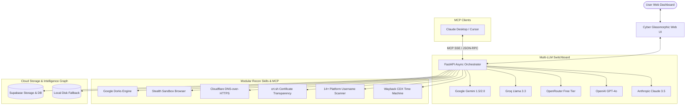

<div align="center">

# 🌐 SUPER OSINT AI AGENT
### *Autonomous Multi-LLM Cyber Reconnaissance & Intelligence Engine*

[](https://python.org)
[](https://fastapi.tiangolo.com)
[](https://render.com)
[](https://modelcontextprotocol.io)
[](LICENSE)

<br/>

> **An autonomous, multi-provider Open Source Intelligence (OSINT) agent engineered for cybersecurity researchers, threat analysts, and bug bounty hunters. Built specifically to stay within Render's 512MB RAM free tier limits (<120MB memory usage) with Supabase Cloud Storage, Google Dorks Engine, Sandbox Browser Execution, and native Model Context Protocol (MCP) hosting.**

<br/>

[Key Features](#-key-features) •
[Architecture](#-system-architecture) •
[Quickstart](#-quick-start) •
[Render Deployment](#-deploying-to-render-free-tier) •
[Custom MCP Setup](#-connecting-via-model-context-protocol-mcp) •
[Contributing](#-contributing)

</div>

---

## ⚡ Key Features

### 🤖 Multi-LLM Gateway with Auto-Fallback
Seamlessly routes queries across top AI providers with zero heavy SDK overhead and automatic failover on rate limits:
- **Google Gemini** (`gemini-1.5-flash` / `gemini-2.0-flash`) — Generous free tier
- **Groq** (`llama-3.3-70b-versatile`) — Sub-second inference on free tier
- **OpenRouter** — Instant access to 100+ open-source models
- **OpenAI** (`gpt-4o`, `gpt-4o-mini`)
- **Anthropic Claude** (`claude-3-5-sonnet`)

### 🎯 Automated Google Dorks Engine
Pre-loaded with 7 targeted categories for defensive reconnaissance and attack-surface discovery:
- **Sensitive Files**: Unprotected `.env`, `.sql`, `.bak`, `.conf`, and private `.pem` keys
- **Open Directories**: Exposed web root indexing (`intitle:"index of /"`), leaked `.git` directories
- **Admin Portals**: Hidden administration panels, cPanel, CMS dashboards
- **Cloud Storage Leaks**: Exposed Amazon S3 buckets, Azure Blobs, Google Cloud Storage
- **Subdomain Footprint**: Discovery of development, staging, API, and VPN endpoints
- **Confidential Documents**: Classified internal PDFs, salary sheets, and financial disclosures
- **Debug & Error Traces**: Exposed stack traces, database exceptions, and PHP errors

### 🌐 Passive Infrastructure & Identity Intelligence
- **Certificate Transparency Subdomains**: Passive discovery via `crt.sh` (zero probe footprint on target)
- **DNS-over-HTTPS (DoH)**: Cloudflare DoH resolution prevents local DNS leaks
- **Security Header Auditing**: Instant posture audit (HSTS, CSP, X-Frame-Options)
- **Cross-Platform Identity Scanner**: Simultaneously probes 14+ public platforms (GitHub, Reddit, Twitter/X, Telegram, GitLab, Keybase, etc.)
- **Wayback Machine CDX Explorer**: Historical snapshot diffing and timeline reconstruction

### 🖥️ Sandbox Browser & Webpage Snapshots
- Built specifically for **Render's 512MB RAM constraints**: offloads heavy headless browser rendering and untrusted script execution to external sandboxes (**E2B / Vercel Sandbox**) or stealth HTTP rendering.
- Captures visual webpage snapshot previews and extracts structured text, metadata, and outbound hyperlinks.

### 🔌 Hosted Custom Model Context Protocol (MCP) Server
- Exposes all OSINT capabilities through standardized JSON-RPC over Server-Sent Events (`/mcp/sse`).
- Easily connect **Claude Desktop**, **Cursor**, or custom AI agents to your hosted tools.

---

## 🏛️ System Architecture



---

## 🚀 Quick Start

### 1. Clone & Install Dependencies
```bash
git clone https://github.com/<your-username>/osint-agent.git
cd osint-agent
pip install -r backend/requirements.txt
```

### 2. Configure Environment Variables
Copy `.env.example` to `.env`:
```bash
cp .env.example .env
```
Add at least one free AI provider API key:
- **Google Gemini** (Free): [https://aistudio.google.com/](https://aistudio.google.com/)
- **Groq** (Free): [https://console.groq.com/](https://console.groq.com/)
- **OpenRouter** (Free): [https://openrouter.ai/](https://openrouter.ai/)
- *(Optional)* **Supabase** (Free 1GB S3 Storage + Postgres): [https://supabase.com/](https://supabase.com/)
- *(Optional)* **E2B Sandbox** (Free sandbox execution): [https://e2b.dev/](https://e2b.dev/)

### 3. Launch Local Server
```bash
python -m uvicorn app.main:app --app-dir backend --host 0.0.0.0 --port 8000 --reload
```
Open **`http://localhost:8000`** in your browser to access the Cyber Intelligence Console.

---

## ☁️ Deploying to Render Free Tier

Render provides 750 free instance hours per month with 512MB RAM. This application is optimized to run at ~100MB RAM.

### Method 1: One-Click Render Blueprint (Recommended)
1. Push this repository to your GitHub account.
2. In [Render Dashboard](https://dashboard.render.com), click **New +** > **Blueprint**.
3. Select your repository. Render reads [`render.yaml`](render.yaml) automatically.
4. Set your `GEMINI_API_KEY` or `GROQ_API_KEY` in Environment Variables.
5. Click **Apply**. Your agent will be live with free automatic SSL.

### Method 2: Manual Web Service
- **Runtime**: `Python`
- **Build Command**: `pip install -r backend/requirements.txt`
- **Start Command**: `uvicorn app.main:app --host 0.0.0.0 --port $PORT --workers 1`
- **Environment Variables**:
  - `PYTHONPATH`: `./backend`
  - `GEMINI_API_KEY`: `<your-gemini-key>`
  - `DEFAULT_LLM_PROVIDER`: `gemini`

---

## 🔌 Connecting via Model Context Protocol (MCP)

Integrate this agent's tools directly into **Claude Desktop** or **Cursor**:

### Claude Desktop Configuration
Add the following to your `claude_desktop_config.json`:
- **macOS**: `~/Library/Application Support/Claude/claude_desktop_config.json`
- **Windows**: `%APPDATA%\Claude\claude_desktop_config.json`

```json
{
  "mcpServers": {
    "super-osint": {
      "url": "https://<your-render-app>.onrender.com/mcp/sse"
    }
  }
}
```

Now Claude can run queries like:
- *"Run a Google Dork scan for exposed environment files on example.com"*
- *"Find all subdomains of target.com via Certificate Transparency logs"*
- *"Check if the username 'targetuser' exists across developer platforms"*

---

## 📁 Repository Structure

```
osint-agent/
├── backend/
│   ├── app/
│   │   ├── main.py                  # FastAPI application & SSE streaming
│   │   ├── config.py                # Environment configuration loader
│   │   ├── agent/
│   │   │   ├── llm_router.py        # Multi-provider LLM gateway & auto-fallback
│   │   │   └── orchestrator.py      # ReAct autonomous intelligence loop
│   │   ├── skills/
│   │   │   ├── google_dorks.py      # Google Dorks engine, generator, & executor
│   │   │   ├── recon_infra.py       # DNS DoH, crt.sh subdomains, security headers
│   │   │   ├── identity_intel.py    # Multi-platform username scanner
│   │   │   ├── web_archive.py       # Wayback Machine CDX timeline explorer
│   │   │   └── sandbox_browser.py   # Hybrid sandbox & stealth scraper
│   │   ├── mcp/
│   │   │   └── server.py            # Standard MCP Server (SSE & JSON-RPC)
│   │   └── storage/
│   │       └── supabase_client.py   # Supabase cloud storage & local fallback
│   └── requirements.txt             # Lightweight dependencies (<120MB RAM)
├── frontend/
│   ├── index.html                   # Cyber intelligence console UI
│   ├── style.css                    # Glassmorphism dark aesthetic & neon accents
│   └── app.js                       # Real-time SSE streaming & Vis-Network graph
├── Dockerfile                       # Production container for Render
├── render.yaml                      # Render Blueprint specification
├── vercel.json                      # Optional static/edge Vercel configuration
├── .env.example                     # Documented configuration template
├── .gitignore                       # Safeguard against pushing secrets/caches
└── README.md                        # Documentation & setup guides
```

---

## 🔒 Ethical Use & Disclaimer

This project is created strictly for **defensive security auditing**, **authorized vulnerability research**, and **open-source threat intelligence**. Always ensure you have appropriate authorization before investigating assets. The creators assume no liability for misuse.

---

## 📄 License

Distributed under the MIT License. See [LICENSE](LICENSE) for more information.
